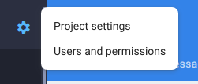
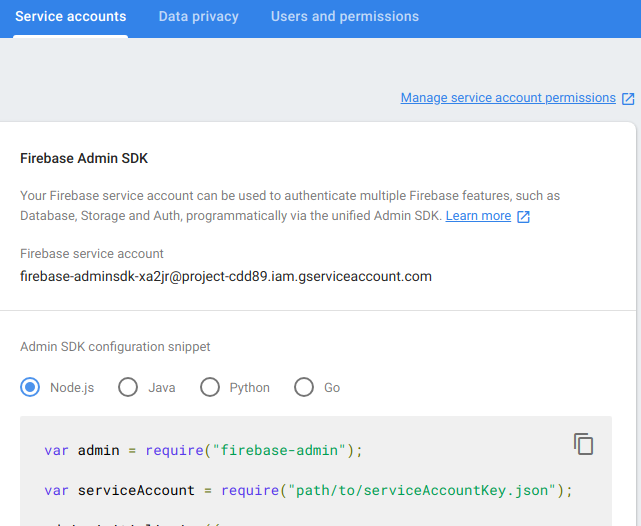
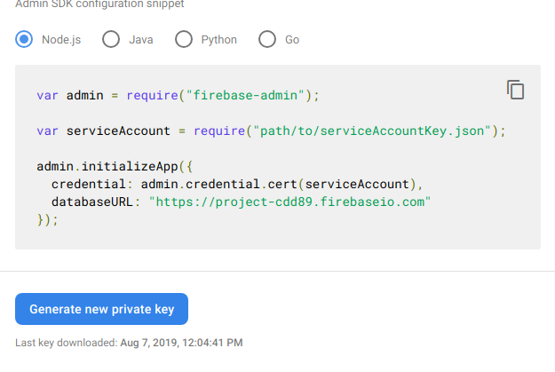
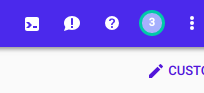
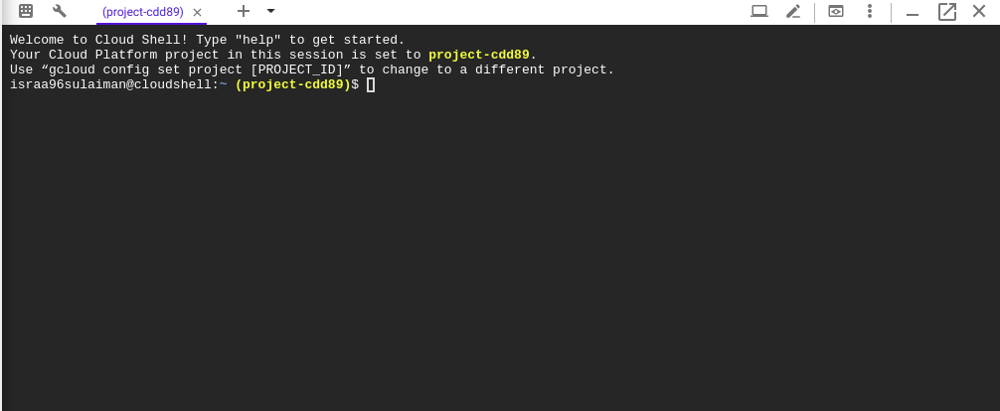

# Firebase Storage


## Firebase project setup

1. Go to the console
2. Add new project
3. Select Web (to connect the firebase project with your app)
4. Add name to register app
5. Your firebase SDK. You can use this SDK to upload and download photos/videos from the front-end. We will be doing it in the server side
(The config is your app's firebase project configration that you will need when you initialize firebase in your app)
6. So, continue
7. Go to Storage
8. Get started
9. Rules. Keep them default. Read about rules & location here

## Firebase Admin SDK
As stated in the documentation:
" Storage for Firebase stores your data in Google Cloud Storage, an exabyte scale object storage solution with high availability and global redundancy. Firebase Admin SDK allows you to directly access your Google Cloud Storage buckets from privileged environments. Then you can use Google Cloud Storage APIs to manipulate the objects stored in the buckets."


### Initialize the Admin SDK
```javascript
var admin = require("firebase-admin");

var serviceAccount = require("path/to/serviceAccountKey.json");

admin.initializeApp({
    credential: admin.credential.cert(serviceAccount),
    storageBucket: "<BUCKET_NAME>.appspot.com" 
    //Bucket is an object in the cloud storage library
    // Bucket name should not contain gs:// or other protocol prefixes
});

var bucket = admin.storage().bucket();
//Here you get a reference to the bucket and you can use it in conjuction with the Google Cloud Storage client libraries to upload, download and modify data in the bucket associated with your firebase project//
```

- Firebase Admin SDK depends on the Google Cloud Storage client libraries to provide Cloud Storage access. The bucket references returned by the Admin SDK are objects defined in these libraries. 

The bucket references returned by the Admin SDK are already authenticated with the credentials used to initialize your Firebase app.

You can get the credentials by following the following steps:
1. Go to the project setting <br>

2. Select Service Accounts from the tab

3. You will see  a section for Admin SDK configuration snippet:
4. Generate new private key <br>

5. a json file will be downloaded. This is your credentials config/ ServiceAccount config. It should be hidden. So use dontenv or env2


## Uploading Objects

You can upload the image in your bucket from the server side using this code.

```javascript
// Imports the Google Cloud client library
const admin = require('admin-firebas');

const admin = require('admin-firebas');

const bucket = admin.storage().bucket();

// const bucketName = 'Name of a bucket, e.g. my-bucket';
// const filename = 'Local file to upload, e.g. ./local/path/to/file.txt';

// Uploads a local file to the bucket
await storage.bucket(bucketName).upload(filename, {
  // Support for HTTP requests made with `Accept-Encoding: gzip`
  gzip: true,
  // By setting the option `destination`, you can change the name of the
  // object you are uploading to a bucket.
  metadata: {
    // Enable long-lived HTTP caching headers
    // Use only if the contents of the file will never change
    // (If the contents will change, use cacheControl: 'no-cache')
    cacheControl: 'public, max-age=31536000',
  },
});

console.log(`${filename} uploaded to ${bucketName}.`);

```
Yet I don't prefer this way since you will be saving the image locally in your server and then upload it to the storage.

## Get All Files

```javascript
const admin = require('admin-firebas');

const bucket = admin.storage().bucket();

const admin = require('admin-firebase');

/**
 * TODO(developer): Uncomment the following line before running the sample.
 */
// const bucketName = 'Name of a bucket, e.g. my-bucket';

// Lists files in the bucket
const [files] = await storage.bucket(bucketName).getFiles();

console.log('Files:');
files.forEach(file => {
  console.log(file.name);
});

```

## Delete Object
```javascript

const admin = require('admin-firebas');

const bucket = admin.storage().bucket();

await storage
  .bucket(bucketName)
  .file(filename)
  .delete();

console.log(`gs://${bucketName}/${filename} deleted.`);

```

## SignedURL

SignedUrl give time-limited resource access to anyone in possession of the URL, regardless of whether they have a Google account.

#### Why to use a signed url?

A signed URL is a URL that provides limited permission and time to make a request. Signed URLs contain authentication information in their query string, allowing users without credentials to perform specific actions on a resource.


**Here is how to generate a signedUrl:**

```javascript
// These options will allow temporary read access to the file
const options = {
  version: 'v4',
  action: 'read',
  expires: Date.now() + 15 * 60 * 1000, // 15 minutes
};

// Get a v4 signed URL for reading the file
const [url] = await storage
  .bucket(bucketName)
  .file(filename)
  .getSignedUrl(options);

console.log('Generated GET signed URL:');
console.log(url);
console.log('You can use this URL with any user agent, for example:');
console.log(`curl '${url}'`);

```

## Configuring CORS

You set CORS configuration on a bucket by specifying information, such as HTTP methods and originating domains, that identify the types of requests it will accept. You can use the gsutil command-line tool, the XML API, the JSON API, or the client libraries for Cloud Storage to set CORS configuration on a bucket.

1. Create a CORS.json config

```json
[
    {
      "origin": ["http://example.appspot.com"],
      "responseHeader": ["Content-Type"],
      "method": ["GET", "HEAD", "DELETE"],
      "maxAgeSeconds": 3600
    }
]

```

2. Go to the google cloud console


3. Use the terminal



4. Upload the file



5. ls in the terminal (you will notice that the file has been uploaded)

6. Write this command in the terminal
```
gsutil cors set cors-json-file.json gs://example-bucket
```
7. Write this command
```
gsutil cors get gs://example-bucket
```

## Sources

### [Signed URL](https://cloud.google.com/storage/docs/access-control/signed-urls)

### [Uploading Objects](https://cloud.google.com/storage/docs/uploading-objects#storage-upload-object-code_sample)

### [Listing Objects](https://cloud.google.com/storage/docs/listing-objects)

### [Deleting Objects](https://cloud.google.com/storage/docs/deleting-objects)

### [Configuring Cors](https://cloud.google.com/storage/docs/configuring-cors)
